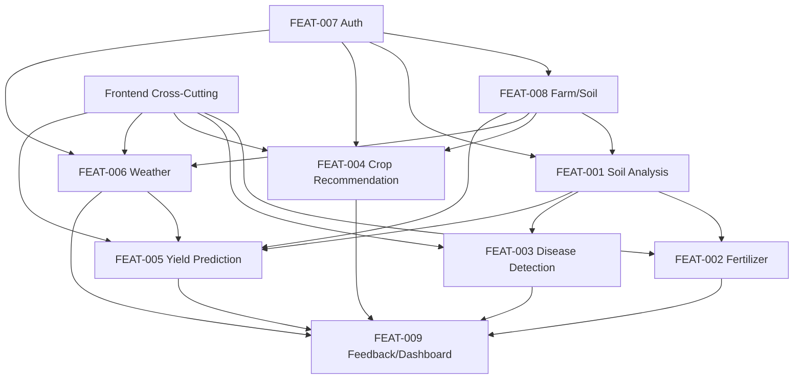

# Master Implementation Plan — AgriAI

**Total Features:** 9 specs + 1 cross-cutting  
**Total Estimated Effort:** ~19 days  
**Last Updated:** 2026-05-14  

---

## Execution Order & Dependencies

```
Week 1 (Foundation):
  ├── Plan-001: Auth & User Management [P0, 3d] ─────────┐
  ├── Plan-010: Frontend Cross-Cutting [P0, 2d] ──────────┤ (parallel)
  └── Plan-002: Farm & Soil Management [P0, 2d] ──────────┘ (after Auth)

Week 2 (Core Predictions):
  ├── Plan-003: Soil Analysis [P1, 2d] ───────────────────┐
  ├── Plan-004: Fertilizer Suggestion [P1, 1.5d] ─────────┤ (after Soil)
  └── Plan-005: Plant Disease Detection [P1, 2d] ─────────┘ (parallel with Fert)

Week 3 (Advanced Features):
  ├── Plan-006: Crop Recommendation [P2, 2.5d] ──────────┐
  ├── Plan-008: Weather Forecast [P2, 2d] ────────────────┤ (parallel)
  └── Plan-007: Yield Prediction [P2, 2d] ────────────────┘ (after Weather)

Week 4 (Integration):
  └── Plan-009: Feedback & Dashboard [P2, 2d] ────────────── (after all predictions)
```

---

## Dependency Graph



---

## Plan Files Index

| # | Plan File | Feature | Priority | Days |
|---|---|---|---|---|
| 1 | `plan-001-auth-user-management.md` | Auth & User Management | P0 | 3 |
| 2 | `plan-002-farm-soil-management.md` | Farm & Soil Management | P0 | 2 |
| 3 | `plan-003-soil-analysis.md` | Soil Analysis Prediction | P1 | 2 |
| 4 | `plan-004-fertilizer-suggestion.md` | Fertilizer Suggestion | P1 | 1.5 |
| 5 | `plan-005-plant-disease-detection.md` | Plant Disease Detection | P1 | 2 |
| 6 | `plan-006-crop-recommendation.md` | Crop Recommendation | P2 | 2.5 |
| 7 | `plan-007-yield-prediction.md` | Yield Prediction | P2 | 2 |
| 8 | `plan-008-weather-forecast.md` | Weather Forecast | P2 | 2 |
| 9 | `plan-009-feedback-dashboard.md` | Feedback & Dashboard | P2 | 2 |
| 10 | `plan-010-frontend-cross-cutting.md` | Frontend Architecture | P0 | 2 |

---

## Key Spec Corrections Made

| Spec | Key Changes in v2.0 |
|---|---|
| Auth | Added refresh/logout endpoints, password complexity, RBAC, account lockout |
| Soil Analysis | Clarified union schema, added async inference path, added HTTP codes |
| Fertilizer | Clarified response field sources (model vs lookup table) |
| Disease | Clarified treatment source (lookup table), added severity derivation |
| Crop Rec. | Added rule-based fallback, LLM provider abstraction, season validation |
| Yield | Specified model type (GBR), yield range calculation method, batch queries |
| Weather | Added circuit breaker, LLM fallback, cache key normalization |
| Farm/Soil | Added DELETE endpoints, pagination, soft-delete, region required |
| Feedback | Added weighted accuracy, UNIQUE constraint, detailed stats object |

---

## Risk Register

| Risk | Impact | Mitigation |
|---|---|---|
| HuggingFace models too slow on CPU | High | Celery async path + GPU option |
| Ollama LLM unavailable | High | Rule-based fallback engine |
| Open-Meteo API downtime | Medium | Circuit breaker + OpenWeatherMap fallback |
| Frontend code duplication | Medium | Layout extraction in Plan-010 |
| No backend exists yet | Critical | Prioritize Auth + Farm as Week 1 foundation |
